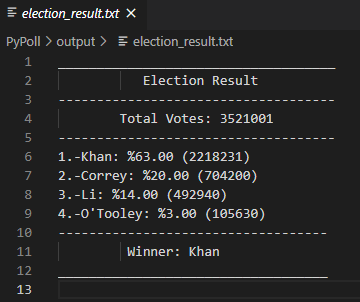

# Python Challenge - Py Me Up, Charlie
PyBank &amp; PyPoll

## Background

Well... you've made it!

It's time to put away the Excel sheet and join the big leagues. Welcome to the world of programming with Python. In this homework assignment, you'll be using the concepts you've learned to complete the **two** Python Challenges, PyBank and PyPoll.

Both of these challenges encompass a real-world situation where your newfound Python scripting skills can come in handy. These challenges are far from easy so expect some hard work ahead!

## PyBank

* In this challenge, you are tasked with creating a Python script for analyzing the financial records of your company. You will give a set of financial data called [budget_data.csv](PyBank/Resources/budget_data.csv). The dataset is composed of two columns: `Date` and `Profit/Losses`. (Thankfully, your company has rather lax standards for accounting so the records are simple.)

### Results

## PyPoll

* In this challenge, you are tasked with helping a small, rural town modernize its vote counting process.

* You will be give a set of poll data called [election_data.csv](PyPoll/Resources/election_data.csv). The dataset is composed of three columns: `Voter ID`, `County`, and `Candidate`. Your task is to create a Python script that analyzes the votes and calculates each of the following:

### Results

